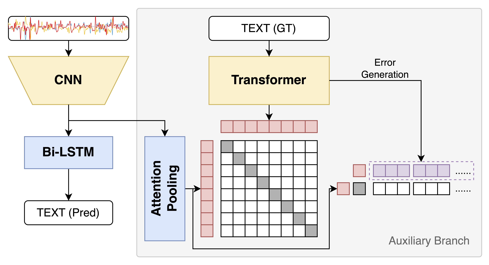

# Enhancing IMU-Based Online Handwriting Recognition via Contrastive Learning with Zero Inference Overhead

This repository contains the official implementation of the paper **"Enhancing IMU-Based Online Handwriting Recognition via Contrastive Learning with Zero Inference Overhead"**.

## Introduction

We introduce **ECHWR** (Error-based Contrastive-enhanced Handwriting Recognition), a framework designed to improve IMU-based handwriting recognition performance. ECHWR leverages a multi-modal contrastive learning approach that aligns IMU sensor signals with text embeddings during training.



Crucially, the framework is designed with **Zero Inference Overhead**: the auxiliary text encoder and pooling modules are utilized only during the training phase. At inference time, the model operates purely as a handwriting recognition backbone, ensuring no additional computational cost.

## Results on OnHW-Words500 right-handed dataset

| CTC | BC  | EC  | WD CER (%) | WD WER (%) | WI CER (%) | WI WER (%) |
| --- | --- | --- | ---------- | ---------- | ---------- | ---------- |
| ✓   |     |     | 14.45      | 43.96      | 7.33       | 15.16      |
| ✓   | ✓   |     | **12.95**  | **40.26**  | 7.03       | 14.31      |
| ✓   | ✓   | ✓   | 14.04      | 41.99      | **6.79**   | **13.65**  |

## Installation

1. **Install PyTorch**: Please follow the instructions on the official PyTorch website to install the version appropriate for your system (CUDA/CPU).

2. **Install Dependencies**: Install the remaining required packages using `requirements.txt`.
```bash
pip install -r requirements.txt
```

## Usage

### Training

In the paper, models are trained in a 5-fold cross validation style, which can be done using the `main.py` to train each fold individually. Please adjust the configurations in the `configs/train.yaml` configuration file accordingly.
```bash
python main.py -c configs/train.yaml
```

Alternatively, you can also train all folds at once sequentially with `train_cv.py`. The script will generate configuration files for all folds in a `temp*` directory and run `main.py` with these configuration files sequentially. After the training is finished, the `temp*` directory will be deleted automatically.
```bash
python train_cv.py -c configs/train.yaml
```

NOTE: Before the training with `train_cv.py`, please make sure the `idx_fold` in `configs/train.yaml` is set to -1.

### Evaluation

As we are using cross validation, the results are already given in the output files of training. However, you can always re-evaluate the model with the configuration and weight you want. In that case, please adjust the `test.yaml` file accordingly and run `main.py` with it.
```bash
python main.py -c configs/test.yaml
```

After you get all results of all folds, you can summarize the results and also calculate the #Params and MACs with `evaluate.py`.
```bash
python evaluate.py -c configs/train.yaml
# or
python evaluate.py -c path_to_config_in_work_dir
```

## License

This project is released under the MIT license. Please see the `LICENSE` file for more information.